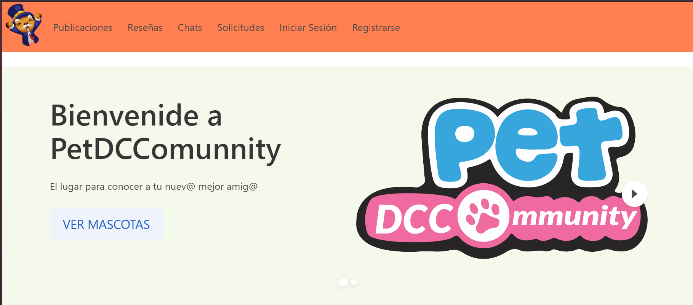

# PetDCCommunity

**PetDCCommunity** is a web application developed for the Software Engineering course during the first semester of 2021 as part of my studies in Civil Engineering at UC. This platform serves as a community for pet lovers, allowing users to share experiences, seek pet adoption or sale opportunities, and connect with others in the community.



## Features

- **User Authentication**: Users can create an account and log in to access exclusive features.
- **Reviews**: Users can leave reviews and feedback on various pets and services.
- **Requests**: A feature view requests from other users.
- **Postings**: Users can create listings for pet adoption or sale, making it easier for pets to find new homes.
- **Homepage**: A user-friendly interface that provides easy navigation and access to all features.

## Requirements

Before running the application, ensure you have the following installed:

- Ruby (version X.X.X)
- Rails (version X.X.X)
- PostgreSQL (or any other database you choose)

## Getting Started

Follow these steps to run the application locally:

1. **Clone the repository**:

   ```bash
   git clone https://github.com/yourusername/petdccommunity.git
   cd petdccommunity
    ```

2. **Create .env file**:

   ```bash
   touch .env
    ```

3. **Add the following environment variables to the .env file**:

   ```bash
   DATABASE_USERNAME=your_database_username
   DATABASE_PASSWORD=your_database_password
   ```

4. **Install dependencies**:

   ```bash
   bundle install
    ```

5. **Create the database**:

   ```bash
    rails db:create
    rails db:migrate
    ```

6. **Run the server**:

   ```bash
    rails server
    ```

7. **Open the application**:
Navigate to `http://localhost:3000` in your browser to access the application.

## Usage

Once you have the application running, you can:

- Register for a new account or log in with an existing account.
- Browse pet listings, leave reviews, and create your own postings for adoption or sale.
- Use the request feature to see if anyone has send you a request.

## Acknowledgements

This project was made with two other classmates.
